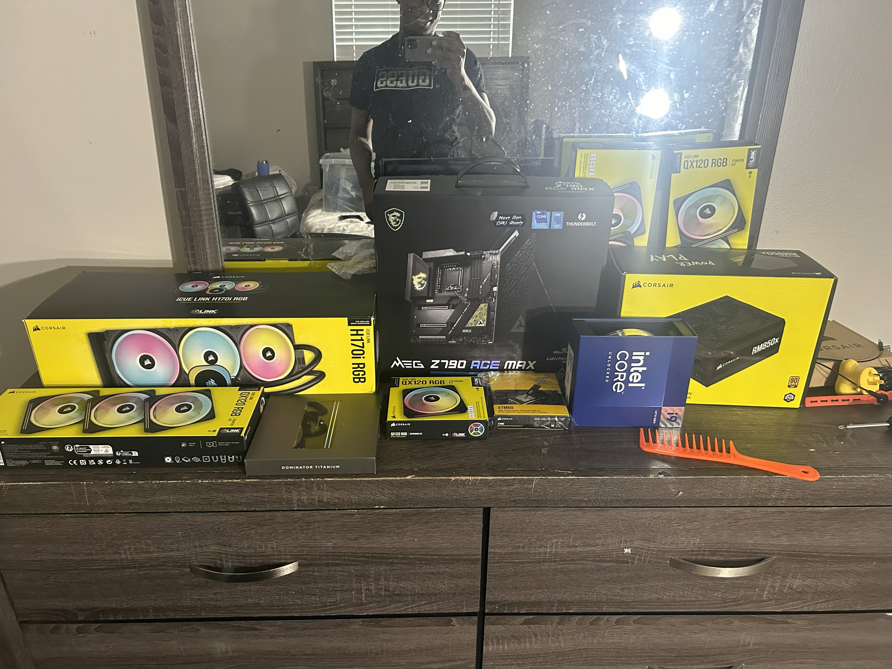
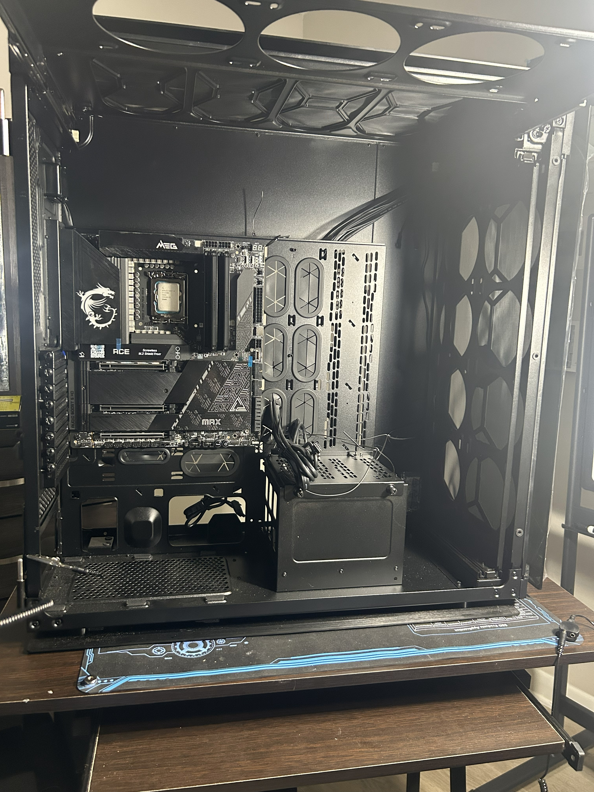
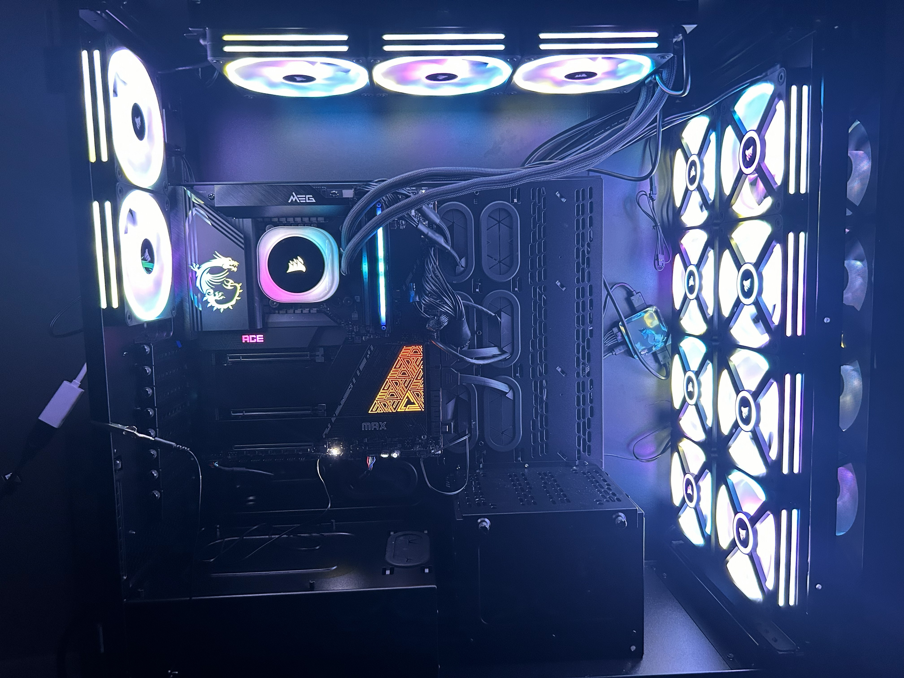

# Build Log

## Planning
- Confirmed CPU socket + motherboard compatibility
- Confirmed RAM type and QVL check (if applicable)
- Planned airflow: front/side intake, top exhaust/radiator

## Assembly Steps
1. Prepared motherboard (bench build)
2. Installed CPU + applied thermal paste
3. Installed RAM + NVMe SSD
4. Mounted motherboard into case
5. Installed PSU and routed power cables
6. Mounted AIO and connected pump/fans
7. Connected front panel, USB headers, and RGB controller
8. Installed GPU and connected PCIe power
9. Cable management and final inspection

## Photos
- Parts: 
- In-progress: 
- Final: 

